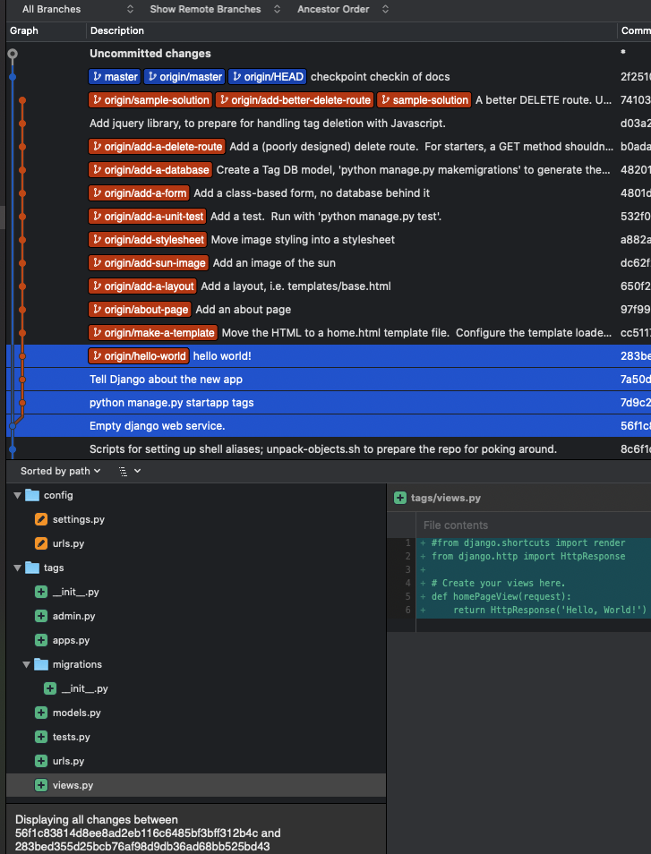

# Prework for Session One

## Environment assumptions
This exercise assumes you have ...
1. A [GitHub](https://github.com){:target="_blank"} account.
1. Python3 3.5 or newer, so that the builtin 'venv' module can be used for configuring virtual environments.

## Fork & clone the repo, and set up and run the webapp

1. Fork [https://github.com/walquis/tags](https://github.com/walquis/tags){:target="_blank"}.

2. Run these commands in a Terminal session (for best results, I recommend starting Terminal.app separately, rather than running a terminal session within your IDE).  You should be able to copy/paste pretty much verbatim, except that you need to replace \<yourlogin\> with your own login.
```console
$ cd                          # Start from your home directory
$ mkdir -p src
$ cd src                      # Or cd to wherever you keep code projects
$ git clone https://github.com/<yourlogin>/tags    # Clone your fork
# (Note that when the actual project exercise starts, you'll to re-clone from your team lead's fork).
$ cd tags
$ python3 -m venv venv        # Use the "venv" module to create a virtual env in the "venv" directory
$ source venv/bin/activate         # Enter your python3 virtual env
$ pip install -r requirements.txt  # Populate current virtual env with packages
$ python manage.py migrate         # Keep Django from complaining about unapplied migrations
$ python manage.py runserver
```
3. Now visit [http://localhost:8000](http://localhost:8000){:target="_blank"} in your browser.

To stop the app: At your shell prompt, hold down the Ctrl key and press 'c'.

(To exit your virtualenv, type 'deactivate' in the shell. This is the opposite of "source venv/bin/active" that we ran above.)

## Explore the code
So what is running, exactly?  You're on the `master` branch of this repo, and the webserver you started up is an empty application.

Let's work our way through the changes, starting from `master` and progressing to the tip of the `sample-solution` branch.  For viewing changes, see the discussion further down in the [README](https://github.com/walquis/tags).  SourceTree or similar is handy.

NOTE: During this course, I highly recommend opening shell windows using the Terminal app on your Mac, and not using whatever shell your IDE opens.  The IDE environment adds a thick layer of complexity that is unnecessary for this purpose.

### hello-world
Check out the `hello-world` branch, and start the app.  (I find it handy to have multiple Terminal windows--one for running the git commands, and one for running the python webserver).  If you've done the setup described above, your Terminal session would look something like this:
```
$ git checkout hello-world
Branch 'hello-world' set up to track remote branch 'hello-world' from 'origin'.
Switched to a new branch 'hello-world'
$ python manage.py runserver
```
Visit [http://localhost:8000](http://localhost:8000).  You should see "Hello, World!" displayed.  Selecting changes in SourceTree as shown below, you can see and browse what had to happen to make this work.



### make-a-template
Now checkout the `make-a-template` branch.  (If you have `python manage.py runserver` running in a separate Terminal window, it will see the changes and reload the server automatically).

It's a little "hard-coded" to put the actual HTML in the same file as the view logic, so this change moves the "Hello, World!" into a template file.  In config/settings.py, we tell Django where to look for templates.

No functionality has changed at http://localhost:8000, but now we're better positioned to make changes, such as...

### about-page
Checkout the `about-page` branch. The /about route is added in urls.py, and its content as a template file.

### Continuing ...
Keep checking out successive branches, viewing code changes in SourceTree while you observe the behavior in the browser.

### add-a-database
With this particular change, there is a little extra work to do, since a database has entered the picture (actually, it was there already, but we just weren't using it).  Because we need a "tags" table, we have to tell Django to add it, corresponding to the `Tag` model we've added.  (Forgetting this step results in "Operational Error at /" in the browser).
```
$ python manage.py migrate
```
At this point, you can begin typing tags into the input box, and seeing them show up in the list below.

### ...all the way to `sample-solution`!
After checking out a couple more changes having to do with adding the ability to delete tags, you've arrived at the tip of the `sample-solution` branch!

### A side note - Debugging with [IPython](https://ipython.readthedocs.io/en/stable/){:target="_blank"}

On the `sample-solution` branch, notice the commented-out ```# embed()``` (as well as the ```from IPython import embed```).  Try uncommenting this line, and refreshing the browser (this is assuming your webserver picks up the change automatically; if not, restart the webserver first).

Code execution now stops at the embed() breakpoint.  You can examine variables by typing them (for instance `request.method`), or run arbitrary code that makes sense in this context.

When ready to continue, type ```quit```.  (And also, don't forget to comment out embed() again).

### Another side note - looking at the Sqlite data directly

To browse your DB without Django, install Sqlite3.  On a Mac, this would be
```
brew install sqlite
```
Where does your Sqlite database live?  [HINT: a settings file might know]

Fire up sqlite3 and start running queries.  In sqlite, commands other than SQL queries are prefixed with ".", e.g. ".help".  To exit, ".q", and so on.
```
$ sqlite3 <path-to-sqlite3-database-file>
sqlite> .headers on
sqlite> .mode column
sqlite> select * from tags_tag;
```

## Bonus prework - explore some [Unix/Shell Concepts](unix-shell-concepts)
I'll cover these *very* briefly in class, but feel free to google around on your own, focusing on the bash shell.
